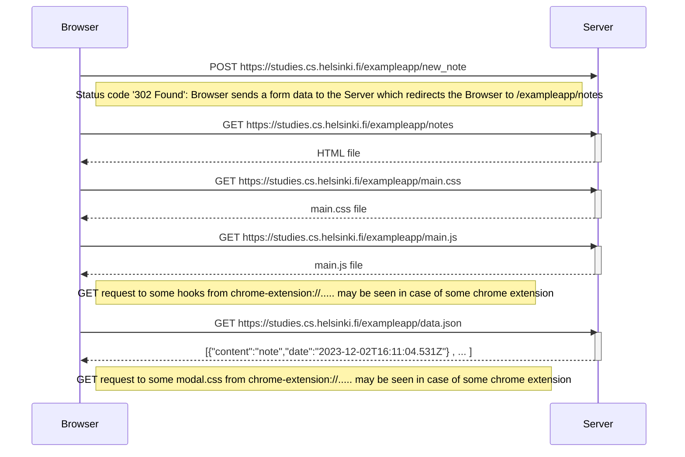

```mermaid
sequenceDiagram
    participant Browser
    participant Server

    Browser->>Server: POST https://studies.cs.helsinki.fi/exampleapp/new_note
    Note right of Browser: Status code '302 Found': Browser sends a form data to the Server which redirects the Browser to /exampleapp/notes

    Browser->>Server: GET https://studies.cs.helsinki.fi/exampleapp/notes

    activate Server
    Server-->>Browser: HTML file
    deactivate Server

    Browser->>Server: GET https://studies.cs.helsinki.fi/exampleapp/main.css

    activate Server
    Server-->>Browser: main.css file
    deactivate Server

    Browser->>Server: GET https://studies.cs.helsinki.fi/exampleapp/main.js
    activate Server
    Server-->>Browser: main.js file
    deactivate Server

    Note right of Browser: GET request to some hooks from chrome-extension://..... may be seen in case of some chrome extension

    Browser->>Server: GET https://studies.cs.helsinki.fi/exampleapp/data.json
    activate Server
    Server-->>Browser: [{"content":"note","date":"2023-12-02T16:11:04.531Z"} , ... ]
    deactivate Server

    Note right of Browser: GET request to some modal.css from chrome-extension://..... may be seen in case of some chrome extension

```