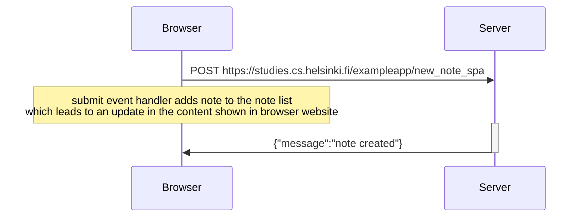

```mermaid
sequenceDiagram
    participant Browser
    participant Server

    Browser->>Server: POST https://studies.cs.helsinki.fi/exampleapp/new_note_spa

    Note over Browser: submit event handler adds note to the note list <br> which leads to an update in the content shown in browser website

    activate Server
    Server->>Browser: {"message":"note created"}
    deactivate Server


```